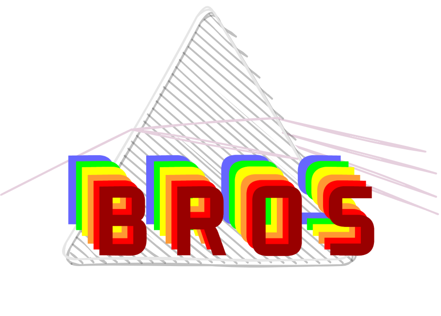

# BrosCloud

## I. Introduction

<div align="center">
    
</div>

**BROS** (i.e. **BR**eaking **O**perating **S**ystem, or short for **Brotherhood**) is a decentralized SaaS platform, which truely implements the goal of "deploy applications anywhere with compute or storage capability", under the concept of **MEC** (Mobile Edge Computing). Specifically, **BROS** decouples traditional applications into three parts: **runtime environment**, **runtime file**, and **rendering computation**, which would be properly deloyed on different machine on the Internet world respectively, to provide near-user service. The goal of **BROS** is to ensure high-quality service for end-users (e.g. low operting latency, short startup delay, etc.) while maximizing the resource utilization for service providers.

## II. Contribution

**BROS** is currently developped by ***Team of Intelligent Networking*** in **University of Electronic Science and Technology of China** (UESTC). We welcome any contribution from open source community to this interesting project. If you have any question, feel free to contact us (Email: zobin1999 AT gmail DOT com).

## III. Performance

## IV. Architecture


Demo version: we build two containers on worker node, daemon and instance. The former takes care of client connection and instance initialization, while the later is responsible for streaming the application.

## V. Usage Guide

### Nginx Config

```bash
sudo docker run --name nginx --restart always -p 80:80 -v /home/broscloud/Code/nginx/logs:/var/log/nginx -v /home/broscloud/Code/nginx/nginx.conf:/etc/nginx/nginx.conf -v /home/broscloud/Code/nginx/conf.d:/etc/nginx/conf.d -d nginx
```

## Related Work
* [giongto35/cloud-morph](https://github.com/giongto35/cloud-morph)
* [wine-mirror/wine](https://github.com/wine-mirror/wine)