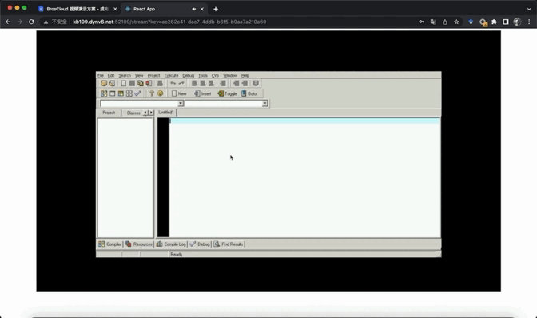

# OpenRaaS

## I. Introduction

<table>
    <tr>
        <td align="center">
            
            Demo - FPS in Browser
        </td>
        <td align="center">
            
            Demo - IDE in Browser
        </td>
    </tr>
</table>

**OpenRaaS** (i.e. Open Resource-as-a-Service) is a decentralized container-based SaaS platform based on the idea of **RaaS**, which truely implements the goal of "deploy applications anywhere with compute or storage capability". Specifically, **OpenRaaS** decouples running context of common applications into three parts: **runtime environment**, **runtime file**, and **render & computation**, which would be properly deloyed on different machine on the Internet world respectively, to provide near-user service. The goal of **OpenRaaS** is to ensure high-quality service for end-users (e.g. low operting latency, short startup delay, etc.) while maximizing the resource utilization for service providers.

## II. Design

<div align="center">
    
</div>

In OpenRaaS platform, we owns four types of entities: **Global Master Node** (MasterNode), **Compute Worker Node** (Computor), **FileStore Woker Node** (Filestore) and **Depository Worker Node** (Depository). 

**MasterNode** is designed for responsing user request as a frontend server. Meanwhile, it collects the status of various worker nodes, and also recording their sevice history for future scheudling. While receiving user request for a specified application, MasterNode would run scheduling algorithm based on the status and history of worker nodes, to orchestrate proper Computor, Filestore and Depository worker node to serve for current user.

**Filestore** worker node serves as a NAS server for persistent storage, it stores files for various application, including binary files, textures, audio files, etc. 

**Depository** worker node serves as a docker image layer repository, which stores various image layers.

**Computor** worker node is resposible for maintaining docker container for running user-specified applications, that is to say that Computor conduct the actual computing and rendering task. Note that Computor would pull locally-missed docker image layers from Depositorys specified by MasterNode, and corresponding files would be mounted into containers from Filestore after container is initilized.

## III. Usage

Modify Nginx configruation file at <code>nginx/conf.d/static.conf</code>:

```nginx
upstream backstage{
    server [Ip and port of Global Master];
}

upstream web{
    server [Ip and port of Web frontend server];
}

server{
    listen 80;
    server_name [Server Domain];

    ...
```

Run OpenRaaS Nginx proxy:

```bash
sudo docker run --name nginx \
    --restart always \
    -p 80:80 
    -v [Path to root]/nginx/logs:/var/log/nginx \
    -v [Path to root]/nginx/nginx.conf:/etc/nginx/nginx.conf \
    -v [Path to root]/nginx/conf.d:/etc/nginx/conf.d \
    -d nginx
```

Modify Web frontend server configuration at <code>web/ant-client-page/src/Configurations</code>

Then run Web frontend server:

```bash
cd web/ant-client-page
npm start
```

Run Global Master by:

```bash
cd backstage
sudo docker-compose up
```

Run Computor daemon by:

```bash
cd winecontainer/serverd
sudo ./serverd
```

## IV. Contribution

**OpenRaaS** is currently developped by ***Team of Intelligent Networking*** in **University of Electronic Science and Technology of China** (UESTC). We welcome any contribution from open source community to this interesting project. If you have any question, feel free to contact us (Email: zobin1999 AT gmail DOT com).

### Contributors:

* Zhuobin Huang
* Yuhang Shen

## Related Work
* [giongto35/cloud-morph](https://github.com/giongto35/cloud-morph)
* [wine-mirror/wine](https://github.com/wine-mirror/wine)